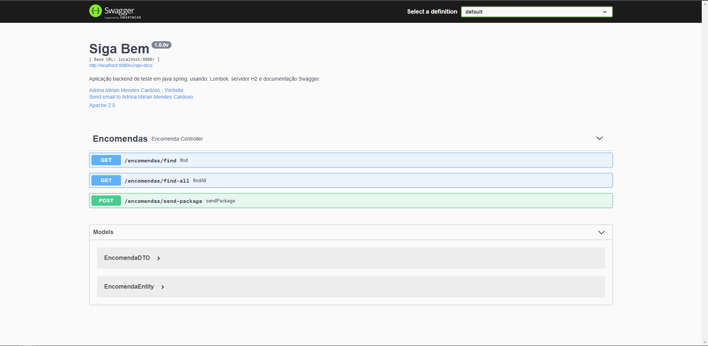

# Siga Bem

O presente projeto é uma aplicação backend desenvolvida em Java com Spring Boot. Durante o desenvolvimento, foram utilizados Lombok, Swagger e o banco de dados em memória H2. A aplicação já inclui registros de teste para validação das funcionalidades.

A aplicação calcula o frete com base no peso da encomenda e nos CEPs de origem e destino. Aplica descontos e prazos conforme DDD e estado, retornando o valor final do frete e a data estimada de entrega.

## Getting Start

### Deploy

1. Clone o repositório:
   ```bash
   git clone git clone https://github.com/AdrianaMendes/java-test.git
   ```

2. Navegue até o diretório do projeto e execute:
   ```bash
   ./mvnw spring-boot:run
   ```

3. Acesse o sistema em:
   ```
   http://localhost:8080/swagger-ui/index.html

### Swagger



## Banco de dados

- O projeto utiliza o **H2 Database** em memória.
  ```
  http://localhost:8080/h2-console
  ```
  - JDBC URL: `jdbc:h2:mem:sigabem`
  - Usuário: `sigabem`

## Licença

Este projeto está sob licença Apache 2.0 © 2022 Adriana Mirian Mendes Cardoso.
Para mais informações acesse o arquivo :scroll: `LICENSE.md`.

## Contato

**Adriana Cardoso**  
Desenvolvedora Java | Spring Boot | Angular  
- 📧 adrianamirianmc@gmail.com
